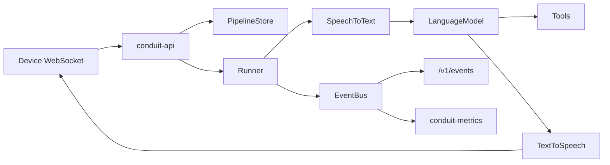

# Architecture

Conduit is a local-first voice assistant framework built around three
boundaries: pipeline definitions are data, providers are interfaces, and
runtime progress is published as events.

## Workspace Layout

| Crate | Responsibility |
| --- | --- |
| `conduit-core` | Shared identifiers, audio formats, device protocol types, event vocabulary, event bus, errors, and the serializable pipeline graph. |
| `conduit-provider` | Object-safe provider traits for speech recognition, language models, synthesis, tools, storage, wake word, speaker identification, and memory. |
| `conduit-runtime` | Resolves a graph against registered providers and runs one conversation turn from captured audio to synthesized speech. |
| `conduit-openai` | OpenAI-compatible provider implementations for chat completions, audio transcriptions, and audio speech. |
| `conduit-wyoming` | Wyoming protocol speech recognition, synthesis, and wake word detection over a TCP endpoint. |
| `conduit-speaker` | Speaker identification over HTTP: Conduit's own contract, and a client for an existing Diarization_Server. |
| `services/speaker-id` | The reference implementation of that contract, published as `conduit-speaker-id` with CPU and GPU tags. |
| `conduit-mcp` | Model Context Protocol client and tool providers over stdio, streamable HTTP, and SSE. |
| `conduit-store` | Memory, file, and PostgreSQL implementations of the pipeline store contract. |
| `conduit-metrics` | Prometheus metrics derived by subscribing to the event bus. |
| `conduit-api` | HTTP service and ops routers, authentication, pipeline CRUD, event streaming, and the conversation WebSocket. |
| `frontend` | React Operator Console app with token-based Operator Access, snapshot-plus-events client boundaries, and top-level Overview, Pipelines, Providers, Events, and Settings sections. |

## Runtime Flow

The API loads a `PipelineGraph` from the configured store, resolves it into a
`Runner`, and upgrades the conversation route to a WebSocket only after auth,
pipeline lookup, graph resolution, and audio-format validation all succeed.

Binary WebSocket frames carry audio in both directions. Text WebSocket frames
carry only device control messages: `end` for utterance completion and `stop`
for user-requested cancellation. Partial transcripts, final transcripts, tool
events, stage failures, token usage, cancellation reasons, and timing all travel
over the event bus instead of the socket audio path.

## Graphs

`PipelineGraph` is a serializable list of nodes and edges. Validation catches
duplicate node ids, dangling edges, cycles, missing source or sink nodes,
disconnected subgraphs, and edges whose two ends disagree about what they
carry. The graph model can describe more than the runtime can execute;
`Runner::prepare` refuses unsupported node kinds and topologies rather than
accepting and ignoring them.

Edges are typed by modality — `audio`, `text`, or `utterance`. A `source` and a
`sink` declare theirs, because nothing about a websocket says whether it carries
microphone samples or typed words; every other kind derives one from what it
does. Recognition reads audio and writes text, a model reads text and produces
an utterance, synthesis speaks an utterance or plain text, and a text sink
writes an utterance down. An utterance is what a model said before anything
decided how to render it, which is what keeps a model unaware of whether it will
be heard or read. A graph wired `tts -> llm -> stt` therefore fails validation
naming the offending edge, rather than failing a stage-order assertion in the
runtime.

`tool`, `memory`, and `router` nodes are not modality transforms — they are the
visible half of a call-and-return arc — so edges touching them are not checked.
[ADR-0012](adr/0012-transport-pipeline-and-reasoning-core.md) removes those
kinds rather than inventing modalities for them.

Modality compatibility is a property of a single edge, so it does not say
anything about paths. A graph wiring `stt -> llm` beside `stt -> tts` has two
compatible edges and still drops the model's answer on the floor, which is why
`Plan::resolve` still asks whether each stage is reachable from the one before
it. Core reachability replaces that check once a graph has exactly one core to
state the rule about.

A node is a typed variant rather than a generic record, tagged by `kind`, and
carries the configuration belonging to that kind: an `llm` node names its
model, system prompt, and round cap; a `tts` node its voice; a `memory` node its
mode, scope, and limit. A node still selects a provider definition by stable id
only. Settings that belong to one pipeline live on the node, so two pipelines
may share a provider definition and request different models from it; settings
that belong to the provider live in its definition. An absent `model` means
whichever model the provider serves first, so a node that expresses no
preference behaves as it did before nodes could express one.

[ADR-0012](adr/0012-transport-pipeline-and-reasoning-core.md) replaces this flat
model with a transport pipeline plus a reasoning core;
[docs/specs/0001](specs/0001-transport-pipeline-and-reasoning-core.md) tracks
that work.

A `core` node is that replacement, and it currently stands beside the kinds it
replaces rather than instead of them. It holds a model binding together with
its tool and memory bindings, so what the model may reach for is configuration
on one node instead of edges describing half of a call-and-return arc. A core
occupies the same place in the transport pipeline as an `llm`: it reads text and
produces an utterance. A tool binding also says whether this pipeline wants to
be asked before that tool runs, which is not visible in the tool's own schema.

A graph reasons in one place. Validation refuses a second reasoning node,
counting `core` and `llm` nodes together, because a pipeline that reasons twice
says nothing about which answer is the reply — and the refusal is about there
being two models rather than about how the graph spells them.

Today the runtime executes at most one wake stage, one identification stage,
one recognizer, one language model, at most one synthesizer, and any number of
tool branches downstream of the model. `router` and `memory` nodes exist in the
graph vocabulary but are not runnable runtime stages yet.

A wake stage gates capture: every chunk reaches the detector and nothing
reaches the recognizer until a phrase is accepted. The gate forwards half a
second of audio from before the activation, because a detector reports some way
after the phrase ended and opening at that instant would clip the first word of
the command. Where detection runs — on a Wyoming server or on the satellite
itself — is a property of the provider definition rather than of the node.

An identification stage forks capture rather than queuing behind it: it and the
recognizer both want the whole utterance, and asking in sequence would double
how long the person waits. The identity it finds is what a tool's per-speaker
permission check sees. A detector that fails ends the turn, because a pipeline
that cannot tell whether it was addressed should not guess; an identifier that
fails does not, because not knowing who is speaking is how every pipeline
behaved before the stage existed.

Validation requires every origin to reach the core and the core to reach every
terminal, so a graph cannot branch past the model and deliver something the
model never saw. A pipeline may have several sources and several sinks: one
core can be fed from a microphone and a chat box and deliver to a speaker and
a transcript, and the same segment is then spoken and written.

Recognition and synthesis are both optional. A turn starts from audio or from
words a client typed, and delivers a `Reply` that is either synthesized speech
or a written segment, so `source(text) -> llm -> sink(text)` runs on a
deployment where the only configured provider is a language model. Absence is
what selects the modality: a graph carrying audio to a model without
transcribing it fails modality validation long before resolution. Sentence
segmentation is shared — what a voice pipeline speaks a piece at a time is what
a text pipeline writes a piece at a time.

## Providers

Providers implement traits from `conduit-provider` and are registered by stable
provider name. A graph node selects a provider by that name; provider-specific
configuration lives in provider registration, not in the pipeline graph.

The runtime stores providers behind trait objects in registries. Dropping a
returned stream is the cancellation mechanism for provider work that is no
longer needed.

## Events And Metrics

The event bus is a bounded broadcast channel. Publishers never wait for slow
subscribers. A subscriber that falls behind drops events and can report its own
drop count.

`conduit-metrics` is just another subscriber. It derives Prometheus counters,
gauges, and histograms from events that already exist, so the audio path does
not call into metrics code directly.

## HTTP Boundaries

`conduit-api` builds two routers:

- service router on `CONDUIT_BIND`, authenticated by handler extractors
- ops router on `CONDUIT_OPS_BIND`, unauthenticated for probes and Prometheus

The service router carries conversations, pipeline CRUD, validation, and event
streaming. The ops router carries `/health`, `/ready`, and `/metrics`; it must
be protected by network placement rather than bearer tokens.

## Storage

Pipeline storage is abstracted by `PipelineStore`. The memory, file, and
PostgreSQL backends share the same conformance expectations:

- names are validated on every method
- list returns only names that can later be read
- missing entries are not errors
- unreadable stored definitions are errors, not absence
- `put` reports whether it replaced an existing pipeline

PostgreSQL migrations are embedded and applied at startup. File writes use a
temporary file and rename so a crash during write does not leave a truncated
pipeline definition.

## Current Limits

The runtime does not yet route between branches or read and write memory. These
are documented as known gaps in [README.md](../README.md).
