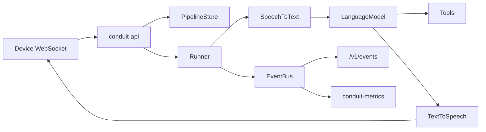

# Architecture

Conduit is a local-first voice assistant framework built around three
boundaries: pipeline definitions are data, providers are interfaces, and
runtime progress is published as events.

## Workspace Layout

| Crate | Responsibility |
| --- | --- |
| `conduit-core` | Shared identifiers, audio formats, device protocol types, event vocabulary, event bus, errors, and the serializable pipeline graph. |
| `conduit-provider` | Object-safe provider traits for speech recognition, language models, synthesis, tools, storage, wake word, speaker identification, and memory. |
| `conduit-runtime` | Resolves a graph against registered providers and runs one conversation turn from captured audio to synthesized speech. |
| `conduit-openai` | OpenAI-compatible provider implementations for chat completions, audio transcriptions, and audio speech. |
| `conduit-store` | Memory, file, and PostgreSQL implementations of the pipeline store contract. |
| `conduit-metrics` | Prometheus metrics derived by subscribing to the event bus. |
| `conduit-api` | HTTP service and ops routers, authentication, pipeline CRUD, event streaming, and the conversation WebSocket. |
| `frontend` | React Operator Console app with token-based Operator Access, snapshot-plus-events client boundaries, and top-level Overview, Pipelines, Providers, Events, and Settings sections. |

## Runtime Flow

The API loads a `PipelineGraph` from the configured store, resolves it into a
`Runner`, and upgrades the conversation route to a WebSocket only after auth,
pipeline lookup, graph resolution, and audio-format validation all succeed.

Binary WebSocket frames carry audio in both directions. Text WebSocket frames
carry only device control messages: `end` for utterance completion and `stop`
for user-requested cancellation. Partial transcripts, final transcripts, tool
events, stage failures, token usage, cancellation reasons, and timing all travel
over the event bus instead of the socket audio path.

## Graphs

`PipelineGraph` is a serializable list of nodes and edges. Validation catches
duplicate node ids, dangling edges, cycles, missing source or sink nodes, and
disconnected subgraphs. The graph model can describe more than the runtime can
execute; `Runner::prepare` refuses unsupported node kinds and topologies rather
than accepting and ignoring them.

Today the runtime executes one recognizer, one language model, one synthesizer,
and any number of tool branches downstream of the model. `router`, `wake_word`,
`speaker_id`, and `memory` nodes exist in the graph vocabulary but are not
runnable runtime stages yet.

## Providers

Providers implement traits from `conduit-provider` and are registered by stable
provider name. A graph node selects a provider by that name; provider-specific
configuration lives in the node's `config` JSON value.

The runtime stores providers behind trait objects in registries. Dropping a
returned stream is the cancellation mechanism for provider work that is no
longer needed.

## Events And Metrics

The event bus is a bounded broadcast channel. Publishers never wait for slow
subscribers. A subscriber that falls behind drops events and can report its own
drop count.

`conduit-metrics` is just another subscriber. It derives Prometheus counters,
gauges, and histograms from events that already exist, so the audio path does
not call into metrics code directly.

## HTTP Boundaries

`conduit-api` builds two routers:

- service router on `CONDUIT_BIND`, authenticated by handler extractors
- ops router on `CONDUIT_OPS_BIND`, unauthenticated for probes and Prometheus

The service router carries conversations, pipeline CRUD, validation, and event
streaming. The ops router carries `/health`, `/ready`, and `/metrics`; it must
be protected by network placement rather than bearer tokens.

## Storage

Pipeline storage is abstracted by `PipelineStore`. The memory, file, and
PostgreSQL backends share the same conformance expectations:

- names are validated on every method
- list returns only names that can later be read
- missing entries are not errors
- unreadable stored definitions are errors, not absence
- `put` reports whether it replaced an existing pipeline

PostgreSQL migrations are embedded and applied at startup. File writes use a
temporary file and rename so a crash during write does not leave a truncated
pipeline definition.

## Current Limits

The runtime does not yet detect wake words, identify speakers, run memory
nodes, route through graph `router` nodes, or ask for human confirmation before
executing a tool. These are documented as known gaps in [README.md](../README.md).
